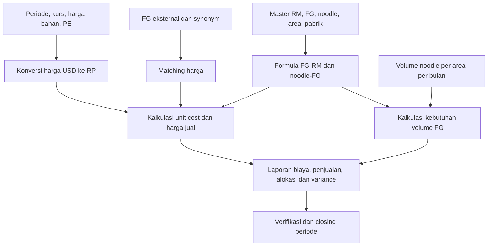

# 01 — Sistem lama dan aturan bisnis

## Peta modul dan sumber

| Modul | Fungsi sumber | Peran |
|---|---|---|
| Login dan password | COST.PRG:5, :134, :156 | `Mmain`, `ENCRYPT`, `User`; membaca register |
| Menu utama | MAINT.PRG:3 | Maintenance, Edit File, Entry, Calculate, Reporting, Closing |
| Buka tabel/index | DATA.PRG:3, :135 | `dataDict`, `Index`; salinan Formula dibuat saat membuka data |
| Master noodle/area/FG/RM | MAINT.PRG:112, :264, :407, :677 | Input, ubah, hapus dan cetak master |
| Formula noodle → FG | MAINT1.PRG:29, :101 | Grid komponen dan standard pemakaian |
| Formula FG → RM | MAINT1.PRG:382, :460 | StandardA, StandardB, batch |
| Factory dan synonym | MAINT1.PRG:785; maint2.prg:3 | Scope area dan pemetaan RM ke FG eksternal |
| Referensi | MAINT.PRG:936 | Periode, kurs current/LE/Q1–Q4, PE |
| Edit file | EDIT.PRG:35, :198 | Perubahan RM/FG langsung; perlu pembatasan di aplikasi baru |
| Input volume/harga | IN.PRG:29, :438 | Volume noodle menurut area dan harga RM |
| Kalkulasi | calc.prg:38, :79, :131, :512 | Kurs, matching, unit cost + price, volume FG |
| Laporan | REP1.PRG:3; REP2–REP71 dan variasinya | 13 pilihan menu dan sublaporan |
| Closing | MAINT.PRG:884 | Ganti periode, opsional reset sebagian nilai FG |

Nomor baris merujuk file yang ada saat analisis. [Peta fungsi](evidence/source-map.json) membantu pencarian tambahan. Tidak ada bukti bahwa setiap PRG di folder dipakai oleh setiap EXE.

## Alur bisnis



Urutan D/F perlu eksplisit pada sistem baru: keduanya dapat mengubah harga RM. Menu lama membiarkan operator menjalankan proses terpisah. Jangan menganggap urutan operator saat ini sudah diketahui.

## Struktur periode

- Suffix `0` ditampilkan sebagai Current.
- `LE` adalah label skenario pada UI lama; kepanjangan dan hubungan tahunnya perlu konfirmasi.
- `1`–`4` adalah kuartal I–IV, dibuktikan teks bantuan Reference pada MAINT.PRG.
- Volume memiliki JAN–DES dan LEJUL–LEDES. Tidak ada tahun pada setiap baris volume.
- `COSTREF.PER` berupa string `ddmmyyyy`, bukan DBF date; snapshot saat analisis adalah `01012027`.

**Usulan:** jadikan tahun anggaran, skenario, dan bulan/kuartal sebagai dimensi eksplisit. Tanggal impor tidak boleh dijadikan tahun data secara otomatis. Current dan LE mungkin mengacu tahun berbeda dari AOP; tetapkan melalui mapping import yang disetujui.

## Aturan kalkulasi yang terbukti

### BR-01 — Konversi harga bahan

`Calc1`, calc.prg:38. Hanya `TYPE_CURR == '1'`:

```text
RP[s] = COSTREF.RATE[s] × RMMAST.USD[s]
s ∈ {0, LE, 1, 2, 3, 4}
```

Record lain tidak diubah oleh fungsi ini. Snapshot berisi 19 RM bertipe `1` dan 2.371 bertipe `2`. Jangan menafsirkan kode lain tanpa validasi.

### BR-02 — Matching harga

`Calc2`, calc.prg:79: mengosongkan FGMast1 lalu append dari `w:FGMast`. Untuk setiap SYNONIM, cari FG eksternal dan RM lokal. `FGMast1.PriceLE/Price1/Price2/Price3/Price4` dipindahkan ke `RMMAST.RPLE/RP1/RP2/RP3/RP4`. Assignment current `Price0 → RP0` dikomentari.

**Usulan:** upload/sinkronisasi snapshot eksternal tervalidasi, tampilkan preview perubahan, dan simpan provenance. Gagal jika mapping ambigu/tidak ditemukan. Jangan menjadikan `SYNONIM.FGCODE` foreign key ke FG lokal: fungsi tersebut memakai master eksternal.

### BR-03 — Standard dan waste

`Calc3`, calc.prg:131, khususnya assignment sekitar :214 dan :400:

```text
qty_budget = STANDARDB × (1 + WASTE)
jika ID tidak kosong: line_cost[s] = qty_budget × RP[s]
jika ID kosong:       line_cost[s] = qty_budget × RP[s] / 1000
UC[s] = jumlah line_cost[s] seluruh baris formula FG
```

Kondisi asli adalah `cId == "* " .or. cId # " "`. Pertahankan bukti string dan uji aturan blank xBase saat membuat compatibility mode. **Jangan mengganti kondisi ini dengan UNIT == KG**: kode tidak memakai UNIT untuk percabangan tersebut.

UI menyebut waste persen, tetapi rumus tidak membagi waste dengan 100. Semua 2.390 RM aktif saat ini memiliki waste nol, sehingga data tidak dapat membuktikan format nonnol. Usulan internal menggunakan rasio desimal (2% → 0,02), dengan mapping legacy yang dikonfirmasi.

StandardA dan StandardB disimpan terpisah. Tidak ditemukan derivasi StandardB = StandardA / Batch pada fungsi input yang diperiksa. Jangan menciptakan hubungan itu. Formula memiliki 10 angka desimal; jangan dipotong menjadi 2 desimal di importer.

### BR-04 — PE dan harga jual

`Calc3` memakai `FGMAST.PECKP`, `PESMG`, `PESBY`, `PEPLG`, masing-masing sama untuk semua slot skenario. Pembacaan PE dari COSTREF dikomentari di fungsi ini.

```text
harga[s,pabrik] = UC[s] + PE[FG,pabrik]
```

Assignment harga dijalankan hanya ketika akumulasi cost untuk slot tersebut tidak nol. Akibatnya, UC nol berpotensi meninggalkan harga lama. Ini perlu keputusan eksplisit: compatibility mode atau koreksi menjadi harga nol/PE dengan versi aturan baru.

Cabang multilevel `LEVEL='Y'` dengan kode sepanjang 5 karakter melewati `Round(...,2)`. Cabang lain umumnya melakukan pembulatan 2 desimal; pada cabang non-Y, kuartal IV juga memiliki pengecualian panjang kode 5. Field UC/harga DBF tetap berskala 2, sehingga hasil akhir juga bergantung pada penyimpanan DBF. Jangan menyamakan pembulatan ekspresi dengan pembulatan saat write. Uji terhadap keluaran EXE untuk batas .005 dan nilai sangat kecil.

Mapping keluarga harga lokal: CKP `PRICE00,PRICELE,PRICE01..04`; SMG `PRICE10,PRICELE1,PRICE11..14`; SBY `PRICE20,PRICELE2,PRICE21..24`; PLG `PRICE30,PRICELE3,PRICE31..34`. **PRICE1 master eksternal tidak sama dengan PRICE01 master lokal.**

### BR-05 — Multilevel

Ketika pengguna memilih multilevel, fungsi menghitung FG dengan LEVEL Y terlebih dahulu, kemudian menyalin harga keluarga CKP (`PRICE00/LE/01..04`) menjadi harga RM dengan kode sama. Setelah itu menghitung FG non-Y. Ini pola dua tahap, bukan algoritma rekursif umum yang terbukti aman untuk kedalaman arbitrer.

**Usulan:** modelkan dependency RM sebagai produk internal, deteksi siklus, dan hitung sesuai urutan dependency. Untuk fase kesetaraan, hasil wajib dibandingkan dengan dua tahap legacy. Snapshot memiliki 12 FG LEVEL Y. Missing RM berkode sama harus menjadi error terjelaskan.

### BR-06 — Volume noodle ke FG

`Calc4`, calc.prg:512:

```text
volume_fg[area,bulan,skenario] = Σ(volume_noodle[area,noodle,bulan,skenario]
                                   × NDLFORM.STANDARD[noodle,fg])
```

VOLUME dikosongkan dan dibentuk ulang. Hasil mempunyai total 12 bulan dan total LE Juli–Desember. Volume DBF berskala 0; presisi hasil perkalian dan kapan dibulatkan perlu ditetapkan.

Potensi masalah statis: index NDLFORM di DATA.PRG adalah NDLCODE+FGCODE, tetapi flush akumulasi pada Calc4 bergantung perubahan FGCODE. FG yang tidak bersebelahan dapat menghasilkan beberapa baris. Data memiliki 70 kelompok (FG,area) berulang. Ini indikasi untuk pengujian, bukan pembuktian sebab tanpa menjalankan EXE. Usulan SQL melakukan GROUP BY dimensi yang benar, lalu rekonsiliasi.

### BR-07 — Closing

`tutup1`, MAINT.PRG:884: operator mengonfirmasi backup, memasukkan periode baru, dan memilih year-end. Program mengganti COSTREF.PER/PERIOD; year-end mencoba mengosongkan UC0..UC4 dan PRICE0..PRICE4.

Ketidaksesuaian: schema FGMAST aktual memakai PRICE00/01.. dan tidak mempunyai PRICE0..4 persis. UCLE dan keluarga harga per pabrik juga tidak seluruhnya disebut reset. Karena source/EXE dapat berbeda, perilaku produksi closing belum terverifikasi.

**Usulan:** closing mengunci snapshot periode lama dan membuka periode baru melalui transaksi; tidak menghapus histori. Opening ulang terbatas dan diaudit. Tanggal menggunakan DATE dengan tahun 4 digit.

## Ketergantungan dan batas analisis

NTX menyimpan indeks, bukan master bisnis terpisah. Reindex tidak perlu menjadi tombol operasi rutin pengguna web. TEMPFORM/TEMPNDL adalah scratch input; FRML/FRML1 disalin dari Formula oleh dataDict. Aplikasi baru harus mempunyai draft per pengguna, bukan tabel sementara global yang saling tertimpa.

REGISTER tidak tersedia, sehingga pengguna/otorisasi lama belum dapat diinventarisasi. Transformasi password di COST.PRG memakai penambahan kode karakter, bukan password hash modern. Akun baru perlu reset/enrollment; jangan mempertahankan transformasi tersebut. Source report yang memiliki byte NUL dibaca sebagai teks untuk analisis; hal ini menambah kebutuhan validasi build produksi.
