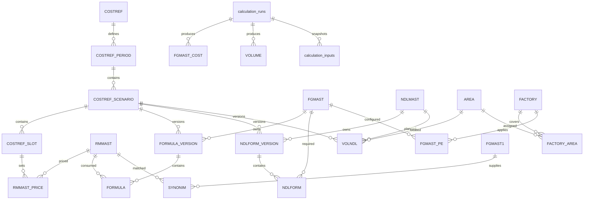

# 03 — Rancangan database Laravel

**Status: usulan desain logis**, bukan schema legacy atau migration siap produksi. Pilihan awal: database relasional dengan transaksi dan foreign key (misalnya PostgreSQL); sesuaikan standar infrastruktur perusahaan sebelum implementasi. Hindari satu tabel lebar berkolom JAN–DES/PRICE00–34 untuk data baru.

## Konvensi

- **Keputusan penamaan:** tabel bisnis utama memakai nama DBF lama tanpa ekstensi `.DBF`, misalnya `RMMAST`, `FGMAST`, `FORMULA`, `NDLFORM`, `VOLNDL`, dan `VOLUME`. Nama pada ERD dan daftar tabel di dokumen ini adalah nama tabel SQL yang direncanakan.
- Tabel tambahan mengikuti nama induk, misalnya `RMMAST_PRICE`, `FORMULA_VERSION`, dan `COSTREF_RATE`. Tabel teknis baru seperti `users`, `audit_logs`, dan `calculation_runs` tetap memakai nama deskriptif karena tidak memiliki padanan bisnis legacy yang setara.
- Nama yang sama tidak berarti struktur dan jumlah baris identik: harga/volume tetap dipisah menurut periode, dan histori tetap dipertahankan. `FORMULA` serta `NDLFORM` tetap menyimpan baris komponen; header versinya berada pada tabel tambahan.
- Perubahan ini menyangkut **nama tabel**. Nama kolom dalam rancangan tetap seperti yang tercantum di bawah; belum ada keputusan untuk menyamakan seluruh kolom dengan DBF. Kamus DBF tetap menjadi rujukan nama kolom asli.
- PK `id` BIGINT. Nama FK tetap deskriptif; targetnya dinyatakan melalui mapping di bawah, bukan ditebak dari nama kolom.
- Kode bisnis VARCHAR(32), simpan leading zero. Nama VARCHAR(255). Nilai lama tetap disimpan pada staging.
- `D = DECIMAL(28,10)` untuk qty/koefisien/perhitungan; `M = DECIMAL(24,6)` untuk kurs/harga; output final legacy 2 desimal disimpan juga bila diperlukan. Jangan gunakan float untuk nilai biaya.
- `created_at`, `updated_at`, `created_by` pada data yang dapat diedit; revision integer untuk optimistic locking. FK delete RESTRICT untuk data historis; penghapusan master memakai is_active, bukan cascade ke transaksi.
- Tabel hasil milik calculation_run yang immutable setelah sukses. Semua hasil satu run terhubung ke snapshot input yang sama.
- Kolom wajib NOT NULL kecuali diberi `?`. Unique key di bawah berlaku pada data terverifikasi, bukan alasan menghapus duplikat staging.

## Nama lama yang dipertahankan

| Tabel DBF lama | Tabel SQL utama | Label menu untuk pengguna |
|---|---|---|
| RMMAST.DBF | RMMAST | RMMAST — Bahan Baku |
| FGMAST.DBF | FGMAST | FGMAST — Finished Goods |
| NDLMAST.DBF | NDLMAST | NDLMAST — Noodle |
| FORMULA.DBF | FORMULA | FORMULA — Formula FG |
| NDLFORM.DBF | NDLFORM | NDLFORM — Formula Noodle |
| VOLNDL.DBF | VOLNDL | VOLNDL — Volume Noodle |
| VOLUME.DBF | VOLUME | VOLUME — Hasil Volume FG |
| AREA.DBF | AREA | AREA — Area Noodle |
| FACTORY.DBF | FACTORY | FACTORY — Pabrik dan Cakupan |
| TYPEMAST.DBF | TYPEMAST | TYPEMAST — Tipe Produk |
| COSTREF.DBF | COSTREF | COSTREF — Referensi Anggaran |
| SYNONIM.DBF | SYNONIM | SYNONIM — Mapping Harga |
| FGMAST1.DBF | FGMAST1 | FGMAST1 — Master FG Eksternal |

Nama huruf besar harus konsisten pada migration, model, foreign key, query, dan lingkungan deployment. Pada PostgreSQL, identifier huruf besar perlu di-quote ketika menulis SQL mentah, misalnya `SELECT * FROM "RMMAST"`; jangan mengandalkan perilaku case-insensitive di mesin pengembangan. Tetapkan nama tabel model secara eksplisit agar ORM tidak menebak bentuk plural. Nama class model dan URL boleh tetap deskriptif; pengguna melihat label tabel lama beserta keterangannya.

File kerja/salinan seperti TEMPFORM, TEMPNDL, FRML dan FRML1 tetap diarsipkan, bukan otomatis dijadikan tabel bisnis aktif. MCDSAP/YC06 menunggu klasifikasi integrasi. Jika diperlukan akses dengan susunan kolom persis seperti DBF, rancang view kompatibilitas read-only pada schema terpisah setelah mapping periode disepakati.

## Mapping foreign key utama

| Kolom relasi pada rancangan | Tabel tujuan |
|---|---|
| material_id | RMMAST |
| fg_id, internal_fg_id | FGMAST |
| noodle_id | NDLMAST |
| area_id | AREA |
| factory_id | FACTORY |
| product_type_id | TYPEMAST |
| costref_id | COSTREF |
| budget_cycle_id | COSTREF_PERIOD |
| scenario_id | COSTREF_SCENARIO |
| cost_slot_id | COSTREF_SLOT |
| formula_version_id | FORMULA_VERSION |
| formula_item_id | FORMULA |
| noodle_formula_version_id | NDLFORM_VERSION |
| external_snapshot_id | FGMAST1_IMPORT |
| external_fg_item_id | FGMAST1 |

Semua relasi di atas mengacu PK `id`. FK teknis lain tetap mengikuti tabel yang dijelaskan pada bagian hasil/audit/migrasi. Penggantian nama tabel tidak mengubah aturan validasi atau kewajiban mempertahankan baris duplikat pada staging.

## ERD inti

ERD menampilkan relasi utama; rincian dimensi dan constraint ada di tabel berikut.

## Master dan cakupan

| Tabel | Kolom bisnis utama | Unique/index/aturan |
|---|---|---|
| units | code, name, dimension | unique code; PC/PCS tidak digabung otomatis |
| RMMAST | code, legacy_code?, name, unit_id, legacy_type?, legacy_id?, currency_code, waste_ratio D, cost_divisor D, internal_fg_id?, is_active | unique code; internal_fg_id → FGMAST; divisor > 0; ID lama disimpan |
| TYPEMAST | code, name | unique code; berasal dari TYPEMAST; scope makna tetap dicek |
| FGMAST | code, legacy_code?, name, secondary_name?, product_type_id?, subtype_code?, batch_qty D, legacy_level, legacy_selling_price M?, is_active | unique code; batch >= 0; subtype tetap string sampai master dikonfirmasi |
| NDLMAST | code, name, unit_id | unique code |
| AREA | code, name, region_code? | unique code; C/W/E bukan factory_id |
| FACTORY | code, name, kind, price_family? | kind physical/aggregate/area_scope; unique code |
| FACTORY_AREA | factory_id, area_id, scenario_id | unique(factory_id,area_id,scenario_id); memungkinkan perubahan cakupan per anggaran |
| FGMAST_PE | fg_id, factory_id, scenario_id, pe M, legacy_hrg M?, revision | unique(fg_id,factory_id,scenario_id); parameter ikut snapshot |

`RMMAST.internal_fg_id` ditambahkan setelah FGMAST dibuat untuk menghindari urutan FK yang bermasalah. Jangan menyatukan RM dan FG hanya karena kodenya sama.

FACTORY memiliki S0/P0 sebagai nasional dan record area; bukan seluruh 25 record adalah pabrik fisik. AREA di FACTORY merupakan string cakupan: misalnya S2 = `C4 C3 C7 C2 C1`; S0 = `W  C  E` memakai kelompok wilayah. Jangan membuat FK literal ke kode `W` jika AREA tidak mempunyai record itu. Expand berdasarkan mapping wilayah yang disepakati dan arsipkan string asli. Label menu Cikampek vs master Purwakarta perlu konfirmasi.

## Anggaran, harga, formula, dan input

| Tabel | Kolom bisnis utama | Constraint |
|---|---|---|
| COSTREF | code, company_name, division_name, legacy_period_raw?, legacy_period_label? | unique code; identitas referensi dari CODE/DESC1/DESC2; periode aktif dibaca dari COSTREF_PERIOD |
| COSTREF_PERIOD | costref_id, name, budget_year, status, opened_at, closed_at? | unique(costref_id,name); status open/closing/closed |
| COSTREF_SCENARIO | budget_cycle_id, code, data_year, revision, status | unique(cycle,code,revision); code current/LE/AOP; bukan menganggap semuanya tahun sama |
| COSTREF_SLOT | scenario_id, code, quarter_no?, starts_on?, ends_on? | unique(scenario_id,code); CURRENT/LE/Q1..Q4; quarter 1..4 bila ada |
| COSTREF_RATE | cost_slot_id, currency_from, currency_to, rate M | unique(slot,from,to); rate > 0 |
| RMMAST_PRICE | material_id, cost_slot_id, currency_code, source_amount M, rupiah_amount M?, source_kind, external_snapshot_id?, revision | unique(material_id,slot); source_kind manual/fx/external/internal; missing tidak dipaksakan nol |
| FORMULA_VERSION | fg_id, scenario_id, version_no, batch_qty D, status, effective_on? | unique(fg,scenario,version); satu versi approved terpilih per run |
| FORMULA | formula_version_id, line_no, material_id, standard_a D, standard_b D, legacy_seq? | unique(version,line_no); RM boleh berulang pada baris berbeda |
| NDLFORM_VERSION | noodle_id, scenario_id, version_no, status | unique(noodle,scenario,version) |
| NDLFORM | noodle_formula_version_id, line_no, fg_id, standard D | unique(version,line_no); duplicate FG ditinjau sebelum approve |
| VOLNDL | noodle_id, area_id, scenario_id, month_no, quantity D, revision | unique(noodle,area,scenario,month); month 1..12 |
| FGMAST1_IMPORT | source_system, filename, sha256, imported_at, status | unique(source_system,sha256) |
| FGMAST1 | external_snapshot_id, code, name | unique(snapshot,code) |
| FGMAST1_PRICE | external_fg_item_id, legacy_slot, amount M | unique(item,legacy_slot); current dipertahankan meski Calc2 tidak memakainya |
| SYNONIM | material_id, external_fg_item_id, scenario_id, status | unique(material,scenario) untuk mapping approved; konflik di staging |

Simpan input harga sebelum dan sesudah FX/matching sebagai versioned snapshot, walaupun tabel RMMAST_PRICE merepresentasikan nilai editable terkini. Perubahan master waste/unit/PE harus membuat run lama tetap reproducible melalui snapshot.

## Hasil, audit, dan migrasi

| Tabel | Kolom utama | Aturan |
|---|---|---|
| calculation_runs | budget_cycle_id, requested_by, status, rule_version, input_hash, idempotency_key, started_at?, finished_at?, error_summary? | unique idempotency_key; queued/running/succeeded/failed; constraint satu run publish pada scope |
| calculation_inputs | calculation_run_id, entity_type, entity_key, payload JSON, sha256 | snapshot lengkap nilai, versi formula, coverage pabrik, scenario dan external source |
| FGMAST_COST | calculation_run_id, fg_id, cost_slot_id, unit_cost D, legacy_unit_cost M | unique(run,fg,slot) |
| FGMAST_PRICE | calculation_run_id, fg_id, factory_id, cost_slot_id, pe M, selling_price M | unique(run,fg,factory,slot) |
| FORMULA_COST | calculation_run_id, formula_item_id, cost_slot_id, standard_b D, waste_ratio D, divisor D, quantity D, unit_price M, amount D | unique(run,item,slot); detail audit |
| VOLUME | calculation_run_id, fg_id, area_id, scenario_id, month_no, quantity D, legacy_quantity D | unique(run,fg,area,scenario,month) |
| period_closures | budget_cycle_id, published_run_id, closed_by, closed_at, snapshot_hash, backup_reference | FK published_run_id → calculation_runs; satu closure aktif per cycle |
| users/roles/role_user | username/email, password hash; role code; assignment | unique identitas; reset password, tidak impor transformasi lama |
| audit_logs | actor_id?, action, entity_type, entity_id, before JSON?, after JSON?, request_id, occurred_at | append-only; jangan merekam password |
| import_batches | filename, sha256, mapping_version, status, counts JSON, imported_by | idempotensi berdasarkan hash + mapping_version |
| import_rows | import_batch_id, source_record_no, deleted_flag, raw_payload JSON, status, errors JSON | unique(batch,record_no); tidak menghilangkan baris bermasalah |
| legacy_record_links | import_row_id, target_table, target_id | jejak satu sumber dapat menghasilkan banyak baris normalisasi |

Jumlah uang/qty total di laporan dihitung dari detail run, bukan dari master yang sedang diedit. Tambahkan indeks filter `(scenario_id,month_no,area_id)` pada volume dan `(fg_id,cost_slot_id)` pada hasil sesuai hasil profiling query.

## Mapping migrasi

| Sumber | Target | Transformasi |
|---|---|---|
| RMMAST | RMMAST + RMMAST_PRICE | kode sebagai teks; USD/RP0,LE,1..4 di-unpivot ke COSTREF_SLOT |
| FGMAST | FGMAST + FGMAST_PE + arsip hasil legacy | UC0/LE/1..4 dan PRICE keluarga per pabrik dipisah; HRG tidak ditafsirkan sebagai hasil Calc3 tanpa konfirmasi |
| FORMULA | FORMULA_VERSION + FORMULA | kelompok FG, pertahankan nomor record dan semua baris; StandardA/B tidak dihitung ulang |
| NDLMast/NDLForm | NDLMAST + NDLFORM_VERSION + NDLFORM | referensi missing ke quarantine |
| VOLNDL | VOLNDL | JAN..DES menjadi bulan 1..12 AOP; LEJUL..LEDES menjadi 7..12 LE; tahun ditetapkan operator |
| VOLUME | arsip hasil legacy + rekonsiliasi VOLUME | jangan langsung unique/upsert karena ada duplikat; agregasi hanya setelah persetujuan |
| AREA/FACTORY | AREA/FACTORY/FACTORY_AREA | parse cakupan, pisahkan aggregate scope dari physical factory |
| TYPEMAST | TYPEMAST | tetap simpan kode nonnumerik |
| COSTREF | COSTREF + COSTREF_PERIOD/COSTREF_SCENARIO/COSTREF_SLOT/COSTREF_RATE | identitas referensi tetap; tanggal ddmmyyyy; PE lama diarsipkan walau tidak digunakan Calc3 |
| SYNONIM/FGMAST1 | SYNONIM + FGMAST1_IMPORT + FGMAST1 + FGMAST1_PRICE | verifikasi sumber W dan resolusi konflik mapping |
| MCDSAP/YC06* | staging integrasi + mapping lanjutan | belum cukup bukti untuk mendesain modul SAP transaksi |
| FRML/FRML1/TEMP*/RMQTY/RMAMT/RMVALUE/SLSVALUE | arsip atau hasil per-run | tidak menjadi shared scratch tabel aplikasi baru |
| DBF lain, XLSX/WK1 | arsip sampai klasifikasi disetujui | nama Copy/TEST tidak cukup untuk membuang data |

Jangan menyalin `.NTX` menjadi tabel. Memo FOXUSER.FPT adalah artefak pendamping; bukan dasar akun bisnis REGISTER.

## Referensi teknis penamaan

- [Laravel Eloquent — penetapan nama tabel model](https://laravel.com/framework/docs/eloquent#table-names): nama tabel dapat ditentukan secara eksplisit ketika berbeda dari konvensi bawaan.
- [PostgreSQL — identifier dan huruf besar/kecil](https://www.postgresql.org/docs/16/sql-syntax-lexical.html#SQL-SYNTAX-IDENTIFIERS): identifier yang di-quote mempertahankan case; identifier tanpa quote dilipat ke huruf kecil.
